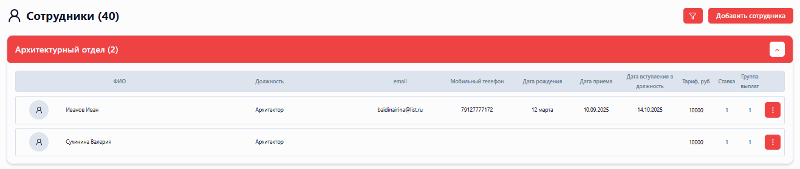
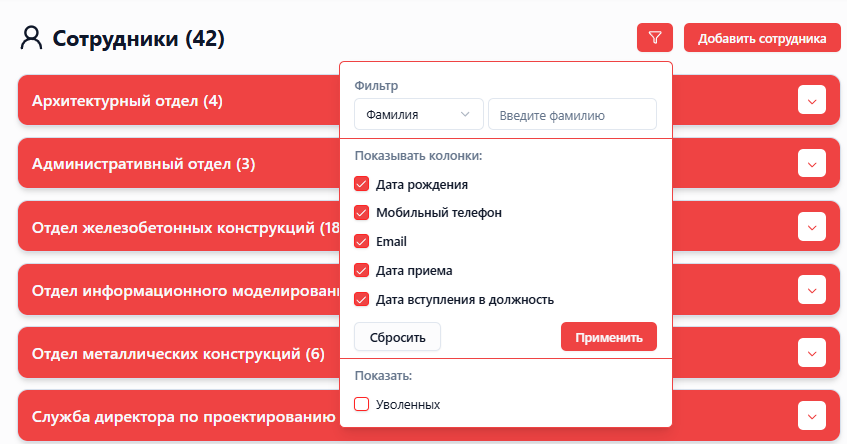
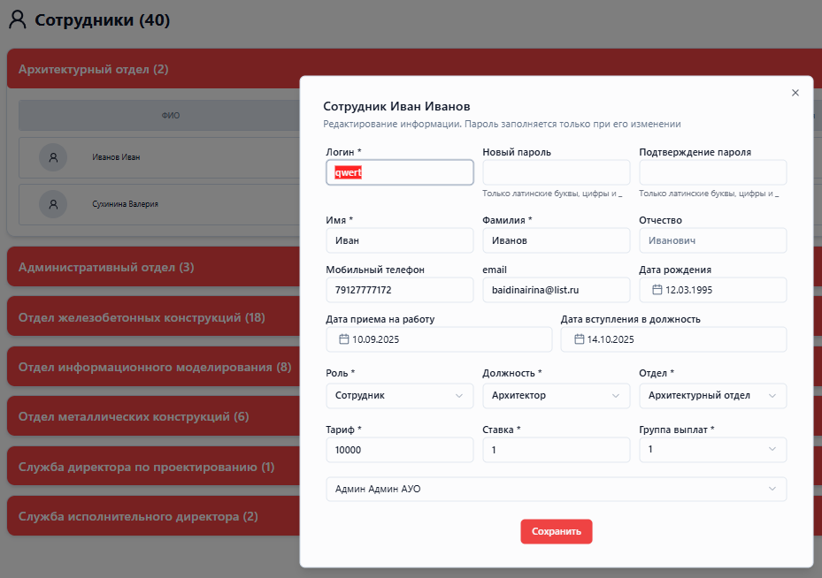
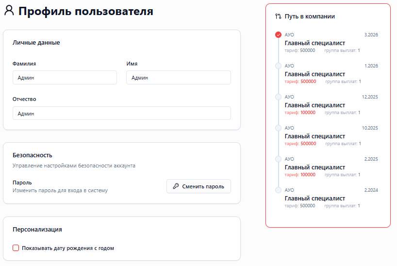

<h1 align="center">Employee Management Platform</h1>

Платформа для учета рабочего времени, отчетности, планирования ресурсов и финансовых потоков

<h2>О проекте</h2>

Данный проект представляет собой клиент-серверное веб-приложение для управления сотрудниками компании, учета рабочего времени и анализа организационной структуры.

Репозиторий содержит демонстрационную часть проекта.

<h2>Архитектура</h2>

Приложение построено по клиент-серверной архитектуре.

<ul>
<li>Frontend → React + TypeScript</li>
<li>Backend → Django REST Framework</li>
<li>Взаимодействие → REST API</li>
</ul>

Поток данных:

<pre>
Frontend → Provider → API → Backend → Database
</pre>

<h2>Стек технологий</h2>

<h3>Frontend</h3>
<ul>
<li>JavaScript / TypeScript</li>
<li>React</li>
<li>Vite</li>
<li>Tailwind CSS</li>
</ul>

<h3>Backend</h3>
<ul>
<li>Python</li>
<li>Django</li>
<li>Django REST Framework</li>
</ul>

<h3>Database</h3>
<ul>
<li>PostgreSQL</li>
<li>Redis</li>
</ul>

<h3>DevOps</h3>
<ul>
<li>Docker</li>
<li>Nginx</li>
<li>GitLab CI/CD</li>
</ul>

<h2>Основной функционал</h2>

<ul>
<li>Управление сотрудниками (CRUD)</li>
<li>Ролевая модель (админ, руководитель, сотрудник)</li>
<li>Фильтрация и настройка отображения данных</li>
<li>История изменений (timeline)</li>
<li>Персонализация отображения профиля</li>
</ul>

<h3>Frontend</h3>

<ul>
<li>Разработка модуля "Сотрудники"</li>
<li>Реализация таблицы сотрудников (GenericTable)</li>
<li>Фильтрация и настройка отображения данных</li>
<li>Форма создания/редактирования сотрудников с валидацией</li>
<li>Реализация пользовательского профиля</li>
<li>Разработка timeline (история изменений)</li>
</ul>

<h2>Взаимодействие frontend и backend</h2>

<pre>
React Component
   ↓
Context / Provider
   ↓
API layer
   ↓
HTTP request (REST)
   ↓
Django View
   ↓
Serializer
   ↓
Database
</pre>

<h2>Интерфейс приложения</h2>

Нажмите, чтобы развернуть скриншоты

 

<table>
  <tr>
    <td align="center">
      <b>Список сотрудников</b> 
      
    </td>
    <td align="center">
      <b>Фильтрация</b> 
      
    </td>
  </tr>
  <tr>
    <td align="center">
      <b>Форма для управления данными сотрудника (CRUD)</b> 
      
    </td>
    <td align="center">
      <b>Timeline (история изменений)</b> 
      
    </td>
  </tr>
</table>

<h2>Установка</h2>

<pre>
npm install
npm install --silent --legacy-peer-deps
npm run dev
</pre>

